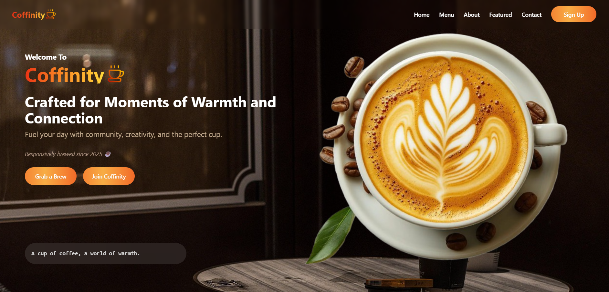
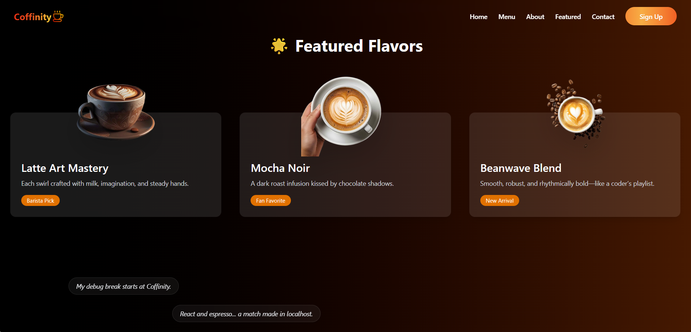
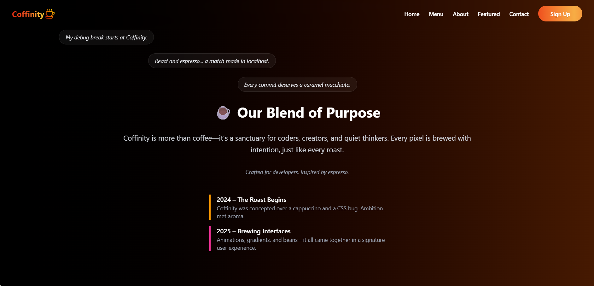
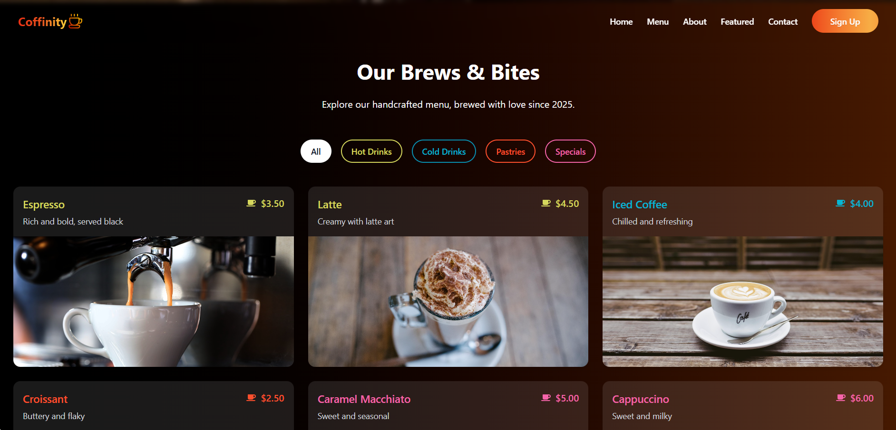

# Coffinity ☕

A high-performance, modern coffee shop landing page built with React, TypeScript, and Vite.

🌐 Live Demo:
👉 https://coffinity.vercel.app/

# 📸 Screenshots

Hero Section:


Features:


About:


Menu:


## ✨ Features

- **Smooth Scrolling**: Integrated with **Lenis** for a buttery-smooth, modern scrolling experience.
- **Dynamic Animations**: High-performance scroll-triggered animations using **GSAP (ScrollTrigger)** for the hero section and other interactive elements.
- **Optimized Assets**: Custom **3D-styled coffee assets** generated using AI for instant loading and a premium look.
- **Modern UI**: Styled with **Tailwind CSS 4**, featuring responsive layouts, backdrop blurs, and elegant typography.
- **Interactive Menu**: Category-filtered menu with color-coded pricing, icons, and detailed item modals.

## 🛠️ Tech Stack

- **Framework**: React 19 + TypeScript
- **Build Tool**: Vite 7
- **Styling**: Tailwind CSS 4
- **Animations**: GSAP (ScrollTrigger), Framer Motion
- **Smooth Scroll**: Lenis
- **Icons**: Lucide React, React Icons

## Getting Started
1. **Clone the repository**
```bash
git clone https://github.com/sazid-zero/coffinity.git
cd coffinity
```

2. **Install Dependencies**:
   ```bash
   npm install
   ```

3. **Run Development Server**:
   ```bash
   npm run dev
   ```

4. **Build for Production**:
   ```bash
   npm run build
   ```

## 📂 Project Structure

- `src/components/`: Reusable UI components (Nav, Button, MenuModal).
- `src/pages/`: Page sections (Hero, Featured, Menu, About, Contact).
- `src/assets/`: Static assets.
- `attached_assets/`: Optimized stock images and generated 3D assets used across the site.

## Deployment

The build command runs `npm run build` and serves the production-ready files from the `dist` directory. 

- **Animation Batching** - Coordinated animations to prevent jank
- **Intersection Observer** - Pause animations when out of view
- **GPU Acceleration** - Hardware-accelerated transforms
- **Lazy Loading** - Images load only when needed
- **Smart Intervals** - Pause timers when tab is inactive


## 📄 License

MIT License - feel free to use this project for personal or commercial purposes.

---

*Crafted with ☕ and code*
